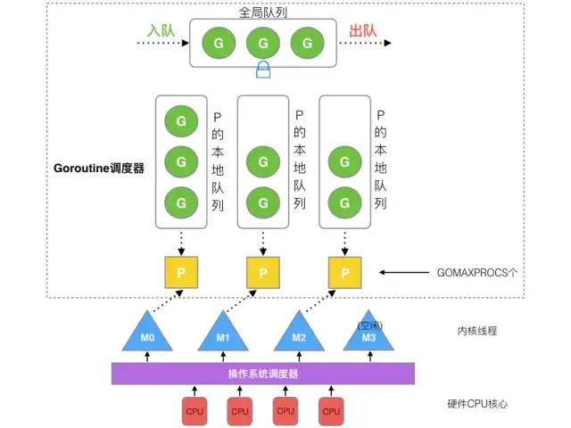
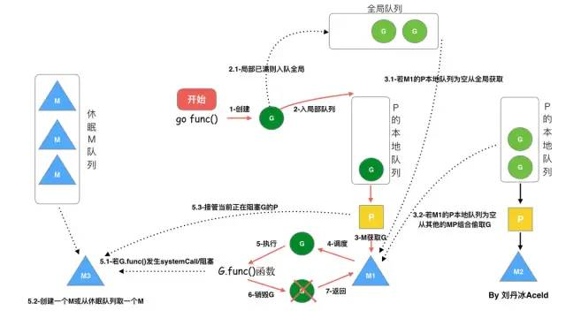

# Golang 编程进阶之（四）

GMP 协程调度

## 背景

* 多进程、多线程(thread)优点：
  * 业务角度：可以提高系统的并发能力。
  * 系统角度：可以高效的利用CPU。
* 在当今互联网高并发场景下，就需要创建大量的进程、线程，进而使得多进程、多线程会有如下缺点：
  * 高内存占用
  * 调度高消耗CPU(进程、线程创建、切换、销毁都会占用相对较长的CPU时间)
* 线程与协程的区别与联系：
  * 线程与协程的相同点即为多线程的优点部分。参考上方。
  * 线程是由CPU调度，是抢占式的；协程是由用户态调度，是协作式的。一个协程让出CPU后，才执行下一个协程。
  * Go 中通过把 m 个协程映射到 n 个线程，来实现调度模型。这是 N:1 与 1:1 类型的组合，利用了这2种模型的有点，并且克服了它们所存在的缺点。但是其实现复杂度也更高。
  * 内核态线程称之为：`thread`；用户态线程称之为：`co-routine`；`goroutine` 是 `co-routine` 的一种改进实现版本。在 `coroutine` 中要等待一个协程主动让出 CPU 才执行下一个协程。在 Go 中，一个 `goroutine` 最多占用 CPU 10ms，防止其他 goroutine 被饿死，这是 `goroutine` 不同于 `coroutine` 的一个地方。
* 在 Linux 操作系统来讲，CPU 对进程的态度和线程的态度是一样的。CPU 并不知道有用户态协程的存在，它只知道内核态线程，因此一个用户态协程必修要绑定一个内核态线程来运行。
* Go 为了提供更容易使用的并发方法，使用了 `goroutine` 和 `channel` 。 `goroutine` 来自协程的概念，让一组可复用的函数运行在一组线程之上，即使有协程阻塞，该线程的其他协程也可以被 `runtime` 调度，转移到其他可运行的线程上。最关键的是，程序员看不到这些底层的细节，这就降低了编程的难度，提供了更容易的应用程序级别并发的实现。
* Go 中，协程被称为 goroutine, 它非常轻量，一个 goroutine 只占用几 KB，并且这几 KB 就足够goroutine 运行完，这就能在有限的内存空间内支持大量的 goroutine，支持了更多的并发。虽然一个 goroutine 的栈只占用几 KB，但实际是可伸缩的，如果需要更多的内容，runtime 会自动为 goroutine 分配。

## 演进过程

* Go 2012年之前的版本调度实现（G + M）。
  * M 想要执行、放回 G 都必须访问全局 G 队列，并且 M 有多个，即多线程访问同一个资源需要加锁进行保证互斥/同步，所以全局G队列是有互斥锁进行保护的。
* Go 2012年开始新设计的调度实现 (G + P + M)
  * P 中维护了本地的G队列，减少了其对对全局G队列的访问，降低了多线程访问全局G队列的次数，因此提升了调度效率。
  * M 执行时，先需要获取/创建一个空闲的 P ，进而获取到可运行的 G。

## 概念浅析

* GMP
  * G，goroutine，协程。
  * M，thread， 操作系统协程，也是实现程序执行的载体。G / P 只是其中的结构或者是被调用的函数而已。
  * P，processor，处理器，包含了运行 goroutine 的资源，还包含了可运行的 G 队列；如果线程想运行 goroutine，必须先获取 P 。这里处理器并不是指 CPU，而展示一个逻辑概念。

## 演进的背后

* 老调度器的缺点
  * 创建、销毁、调度 G 都需要每个 M 获取锁，这就形成了激烈的锁竞争。
  * M 转移G会造成延迟和额外的系统负载。比如当G中包含创建新协程的时候，M创建了G'，为了继续执行G，需要把 G' 交给 M' 执行，也造成了很差的局部性，因为 G' 和 G 是相关的，最好放在 M 上执行，而不是其他 M'。
  * 系统调用（CPU 在M之间的切换）导致频繁的线程阻塞和取消阻塞操作，增加了系统开销。
* 新调度器设计文档：[Scalable Go Scheduler Design Doc](https://docs.google.com/document/d/1TTj4T2JO42uD5ID9e89oa0sLKhJYD0Y_kqxDv3I3XMw/edit#heading=h.mmq8lm48qfcw)
  * 虽然文档中并没有涉及到每个细节，但是已经从宏观上揭露了其实现思路。
  * 越来越觉得阅读这种类型的文档，才是真正的打通任督二脉的关键。并且在这样的宏观层面，发现很多系统的很多实现都是相通的，有种顿悟的感觉。（横向发展）
  * 当然，如果我们要把一件事情研究透彻，同时也要结合实现细节，这些细节的处理上往往也可以提现一个工程师的专业素质。（纵向发展）
* 新调度器改进的思路
  * 通过 G 队列的本地化，减少线程互斥锁开销。
  * 通过使相关的 G 尽可能在相同的 线程上执行，最大化利用线程的局部缓存特性。
* 新调度的改进措施
  * 通过引入 P，以及一些巧妙的机制，进而达到上面改进思路中提到的2点。

## GMP 调度实现

### GMP 模型



* 全局队列（Global Queue）: 存放等待运行的 G。
* P 的本地队列：同全局队列类似，存放的也是等待运行的 G，存的数量有限，不超过 256个。新建 G' 时， G'优先加入到 P 的本地队列，如果队列满了，则会把本地队列中的一半的 G 移动到全局队列。
* P 列表：所有的 P 都在程序启动时创建，并保存在数据中，最多有 GOMAXPROCS(可配置)个。
* M: 线程想运行任务就得获取 P，从P的本地队列获取G，P队列为空时，M也会尝试从全局队列拿一批G放到P的本地队列，或从其他P的本地队列偷一半放到自己的 P 的本地队列。M运行G，G 执行之后，M会从 P 中获取下一个 G，不断重复下去。

### go fun() 调度过程



1. 我们通过 `go func()` 来创建一个 `goroutine`
2. 有两个存储 G 的队列，一个是局部调度器 P 的本地队列、一个是全局G队列。新创建的 G 会先保存在 P的本地队列中，如果P的本地队列已经满了就会保存在全局队列中。
3. G 只能运行在 M 中，一个 M 必须持有一个 P，M 与 P 是1:1的关系。M 会从 P的本地队列弹出一个可执行状态的G来执行，如果 P 的本地队列为空，就会向其他的 MP 组合偷取一个可执行的 G 来执行。
4. 一个 M 调度G的执行过程是一个循环机制。调度代码是通过每个M中执行 G0 协程来是实现的。
5. 当 M 执行某个 G 时候，如果发生了 `syscall` 或者其余阻塞操作，M 会阻塞，如果当前有一些 G 在执行， runtime 会把这个线程 M 从 P 中摘除（`detach`），然后再创建一个新的操作系统的线程（如果有空闲的线程可用就复用空线程）来服务这个 P。
6. 当 M 系统调用结束的时候，这个 G 会尝试获取一个空闲的 P 执行，并放入到这个 P 的本地队列。如果获取不到 P，那么这个线程 M 变成休眠状态，加入到空闲线程中，然后这个 G 会被放入全局队列中。

#### 补充规则

* P 本地满再创建新的G
  * 当G在创建新G的时候，发现 P 的本地队列已满，需要执行负载均衡机制（把P中本地队列中前一半的G，还有新创建的G 转移到全局队列）
  * 实现中并不一定是新的 G'，如果 G' 是 G 之后就执行的，会被保存在本地队列，利用某个老的G替换新的G加入全局队列。
  * 这些 G 被转移到全局队列时，会被打乱顺序。

* 唤醒正在休眠的 M
  * 在创建 G 时，运行的 G 会尝试唤醒其他空闲的 P 和 M 组合取执行。
  * 假定 G2 唤醒了 M2，M2 绑定了 P2，并运行 G0，但是 P2 本地队列没有G, M2 此时为自旋线程（没有G 但未运行状态的线程，不断寻找G）。
* M 从全局队列取 G 的规则

  * M 如果需要从全局队列（简称：GQ），会取一批 G 放到与自己绑定 P 的本地队列（函数 `findrunnable()`）。M从全局队列取的G数量符合下面的公式：

  ```golang
  n = min(len(GQ)/GOMAXPROCS + 1, len(GQ/2))
  ```

  * 至少从全局队列取一个 G，但每次并不会从全局队列移动太多的 G 到 P 的本地队列，需要给其他 P 预留。这是全局队列到 P 本地队列的负载均衡。
  
* `work stealing`(偷取)
  * 如果 P 的本地队列、全局队列为空，那么 M 就要从其他 P' 中偷取。
  * 偷 P' 本地队列的一半，并且是 P' 本地队列尾部取一半的 G。
* 自旋线程的最大限制
  * 当与 M 绑定的P本地队列为空，全局队列为空，其他 P' 中也没有多余的 G 可窃取时，M将进入自旋状态，他们不断寻找 `goroutine`.
  * 自旋本质是在运行，线程在运行却没有执行G，就变成了浪费CPU. 为什么不销毁现场，来节约CPU资源。因为创建和销毁CPU也会浪费时间，我们希望当有新 `goroutine` 创建时，立刻能有M运行它，如果销毁再新建就增加了时延，降低了效率。当然也考虑了过多的自旋线程是浪费CPU，所以系统中最多有`GOMAXPROCS`个自旋的线程(当前例子中的`GOMAXPROCS=4`，所以一共4个P)，多余的没事做线程会让他们休眠。

### 调度器的设计策略

* 复用线程，避免频繁的创建、销毁线程，而是对线程的复用。
  * `work stealing` 机制，当本线程无可运行的 G 时， 尝试从其他线程绑定的 P 偷取 G，而不是销毁线程。
  * `hand off` 机制，当本线程因为 G 进行系统调用阻塞时，线程释放绑定的 P，把 P 转移给其他空闲的线程执行。
* 并行利用
  * `GOMAXPROCS` 设置 P 的数量，最多有 GOMAXPROCS 个线程分布在多个 CPU 上同时运行。 `GOMAXPROCS` 也限制了并发的程度，比如 `GOMAXPROCS  = 核数/2` ，则最多利用了一半的 CPU 核进行并行。
* 抢占
  * 在 `coroutine` 中要等待一个协程主动让出 CPU 才执行下一个协程，在 GO 中，一个 `goroutine` 最多占用 10 ms，防止其他 `goroutine` 被饿死，这就是 goroutine 不同于 `coroutine` 的一个地方。
* 全局G队列
  * 在新的调度器中依然有全局G队列，但功能已经被弱化了，当M执行 `work stealing` 从其他 P 偷不到 G 时， 它可以从全局 G 队列获取 G。
  * 在上方提到的 proposal 文档中是，先尝试偷，偷不到再取全局 G；有些技术文档好像顺序是相反的，具体是什么样的优先级，待确认！！！！

### P 和 M 何时会被创建

* P 何时创建？在确定了 P 的最大数量后，运行时系统会根据这个数量创建 n 个 P。
  * 启动时，优先根据环境变量或者是 cpu 个数，初始化默认 P 个数。
  * 当在运行时调用了 runtime.GOMAXPROCS() 时，再重新根据多少，新建或者移除对应个数的 P。
* M 何时创建？没有足够的M来关联 P 并运行其中的可运行的 G 。比如所有的 M 此时都阻塞住了，而 P 中还有很多任务就绪任务，就会去寻找空闲的 M，而这时如果没有空闲的M就会去创建新的 M。

### 有关 P 和 M 的个数问题

* P的数量。由启动时环境变量 `$GOMAXPROCS` 或者是由 `runtime` 的方法 `GOMAXPROCS()` 决定。这意味着在程序执行的任意时刻都只有 `$GOMAXPROCS` 个 `goroutine` 在同时运行。
* M的数量。
  * Go 语言本身的限制：go 程序启动时，会设置 M 的最大数量，默认 10000。但是内核很难支持这么多的线程数，所以这个限制可以忽略。
  * `runtime/debug` 中的 `SetMaxThreads` 函数，设置 M 的最大数量。
  * 一个 M 阻塞了，会创建新的 M 。
* M 和 P 的数量没有绝对的关系，一个 M 阻塞， P就会去创建或者切换另一个 M，所以即使P的数量是1，也可能会创建出很多个M 出来。
* 但是根据以上这些机制，我们发现 M 和 P 的数量关系，遵循这样的规则：`P <= M`

### 特殊的 M0 和 G0

* M0，M0 是启动程序后的编号为 0 的主线程，这个 M 对应的实例会在全局变量 runtime.m0中，不需要在 heap 上分配，M0 负责执行初始化操作和启动第一个 G，在之后 M0 就和其他的 M 一样了。

* G0， G0 是每次启动一个 M 都会第一个创建的 goroutine, G0 是仅用于负责调度的 G，G0 不指向任何可执行的函数，每个 M 都会有一个自己的  G0。 在调度或者系统调用时 G0 的栈空间。在 Golang 内核代码中，全局变量的 G0 是 M0 的 G0.

## 工具

* 可视化 GMP 数据
  * 运用 runtime/trace 包、go tool trace 工具，最终可以通过浏览器的网页的方式可以看见可视化的调度流程
  * 通过debug trace 模式运行编译后的程序 `GODEBUG=schedtrace=1000 ./trace2`，可生成到调度日志到标准输出中。

## 调优

* 待补充

## 推荐阅读

* 30+张图讲解：Golang调度器GMP原理与调度全分析
 https://mp.weixin.qq.com/s/SEPP56sr16bep4C_S0TLgA
* Scalable Go Scheduler Design Doc https://docs.google.com/document/d/1TTj4T2JO42uD5ID9e89oa0sLKhJYD0Y_kqxDv3I3XMw/edit#heading=h.mmq8lm48qfcw
* Scheduling In Go : Part I - OS Scheduler https://www.ardanlabs.com/blog/2018/08/scheduling-in-go-part1.html
* Scheduling In Go : Part II - Go Scheduler https://www.ardanlabs.com/blog/2018/08/scheduling-in-go-part2.html
* Scheduling In Go : Part III - Concurrency https://www.ardanlabs.com/blog/2018/12/scheduling-in-go-part3.html